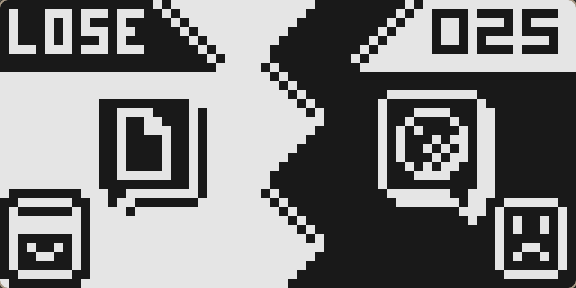
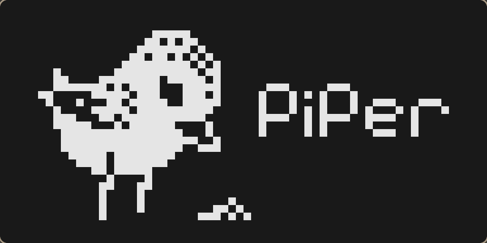

# chip8
A chip8 emulator

## Usage
To run the emulator provide a rom archive in
the command line

```shell
chip8 /path/to/rom.ch8
```

You can pause the emulator with the P key.

## Compatibility
If the emulator appears corrupt or you reach a invalid instruction<br/>
you can try to run the binary with the `cosmic` argument for<br/>
compatibility with CosmicVip instructions.

```shell
chip8 /path/to/rom.ch8 cosmic
```

## Screenshots



